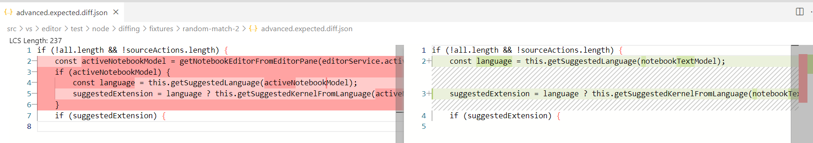

# VS Code Development Diagnostic Tools

This extension helps testing and developing various features (such as the merge and diff editor) in VS Code by providing some diagnostic/development features.

The target audience of this extension are developers working on VS Code itself or users that file bugs for VS Code.

## Commands

### Diagnose Diff Editor: Report Bug

Use this command to quickly report a bug for the diff editor.
It will pre-fill the GitHub form to create an issue in the vscode repository.
The pre-filled form includes a link to the monaco editor playground.
If you only want to share a fragment of the diff, select text on either side before invoking this command.

### Diagnose Diff Editor: Open In Monaco Editor Playground

Use this command to open the current diff in the monaco editor playground.
Used for the report bug functionality.

## Context Menus

### In `merge-conflict` folders: Reproduce Conflict In Playground

This commands expects the folder to contain the files `base.ext`, `input1.ext`, and `input2.ext` (`ext` being some file extension, e.g. `ts`).
Invoking the command creates a git conflict in a given folder, where input2 is merged into input1 and base being the common base.

### In `merge-conflict` folders: Open Folder In Merge Editor

This command expects the folder to contain the files `base.ext`, `input1.ext`, and `input2.ext` (`ext` being some file extension, e.g. `ts`).
Invoking the command opens the merge editor for the given files.

## Custom Editors

### Diff JSON Viewer

This viewer is used to display the diffs produced by the [VS Code diff snapshot tests](https://github.com/microsoft/vscode/blob/2af3045474f52bad8f14f01b09acfd5912e7fb5a/src/vs/editor/test/node/diffing/fixtures/random-match-2/advanced.expected.diff.json).




## Debugger Scripts

This extension allows to run custom scripts when debugging in VS Code.
The VS Code repository makes use of this to enable hot reloading.

### Configuration

Custom scripts can be specified with the `vscode-diagnostic-tools.debuggerScripts` property in the corresponding launch config of the debug session.
The debugger scripts property is expected to be an array of absolute file paths. Use `${workspaceFolder}` to refer to the workspace folder of the launch config.

For example:
```json
{
	"version": "0.2.0",
	"configurations": [
		{
			"name": "Run Extension",
			"type": "extensionHost",
			"request": "launch",
			"args": ["--extensionDevelopmentPath=${workspaceFolder}",],
			"outFiles": ["${workspaceFolder}/out/**/*.js"],

			"vscode-diagnostic-tools.debuggerScripts": [
				"${workspaceFolder}/scripts/my-debugger-script.js"
			]
		}
	]
}
```

### Scripts

A debugger script is a NodeJS module which is expected to export a function called `run` of type [`RunFunction`](./src/debugger-scripts-api.d.ts).
This function is called for every new debug session. The returned dispose function is called when the debug session ends (or when the debugger script is reloaded).

Such a script could look like this:
```js
// @ts-check
/// <reference path='debugger-scripts-api.d.ts' />

console.log('script loaded');

/** @type {RunFunction} */
module.exports.run = async function (debugSession) {
	console.log('script started');

    // This code runs in the debugger
    debugSession.evalJs(function (data) {
        // This code runs in the debuggee (assuming it can evaluate JS expressions)
        console.log(data);
    }, 'some JSON serializable data');

	return {
		dispose() {
			console.log('script stopped');
		}
	};
};
```

Debugger scripts are automatically reloaded when changed.
Before the new script is loaded and executed, the `dispose` function of the previous script is called.
The `dispose` function is also called when the debug session stops.

When multiple debug sessions load the same script, the script is only loaded once, however, the `run` function is called for every debug session.


## Contributing

This project welcomes contributions and suggestions.  Most contributions require you to agree to a
Contributor License Agreement (CLA) declaring that you have the right to, and actually do, grant us
the rights to use your contribution. For details, visit https://cla.opensource.microsoft.com.

When you submit a pull request, a CLA bot will automatically determine whether you need to provide
a CLA and decorate the PR appropriately (e.g., status check, comment). Simply follow the instructions
provided by the bot. You will only need to do this once across all repos using our CLA.

This project has adopted the [Microsoft Open Source Code of Conduct](https://opensource.microsoft.com/codeofconduct/).
For more information see the [Code of Conduct FAQ](https://opensource.microsoft.com/codeofconduct/faq/) or
contact [opencode@microsoft.com](mailto:opencode@microsoft.com) with any additional questions or comments.

## Trademarks

This project may contain trademarks or logos for projects, products, or services. Authorized use of Microsoft 
trademarks or logos is subject to and must follow 
[Microsoft's Trademark & Brand Guidelines](https://www.microsoft.com/en-us/legal/intellectualproperty/trademarks/usage/general).
Use of Microsoft trademarks or logos in modified versions of this project must not cause confusion or imply Microsoft sponsorship.
Any use of third-party trademarks or logos are subject to those third-party's policies.
